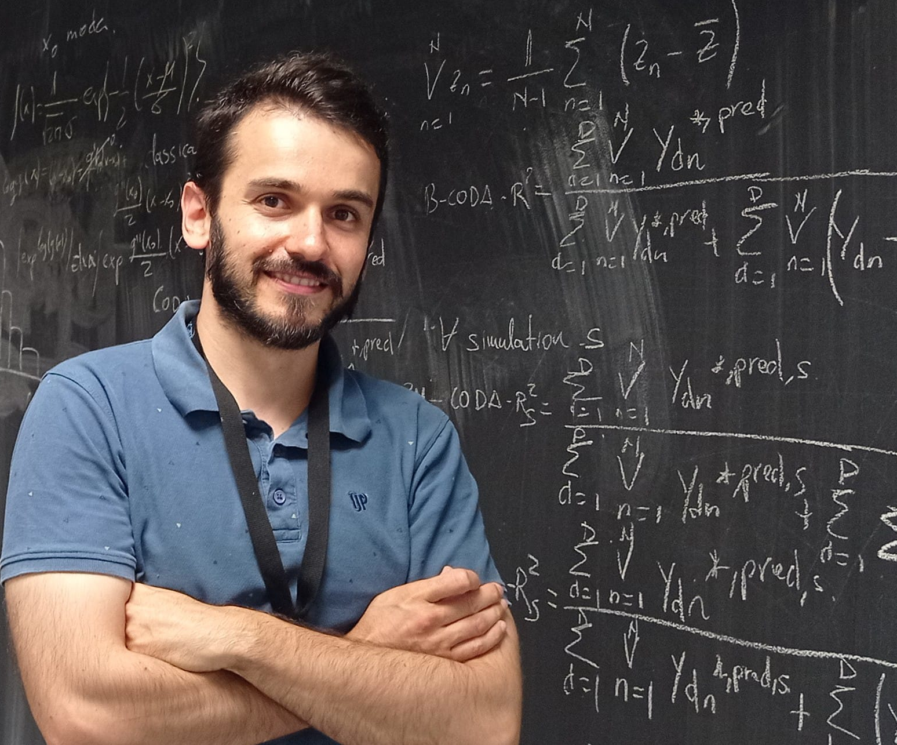

<link rel="stylesheet" href="styles.css" type="text/css">
<link rel="stylesheet" href="academicicons/css/academicons.min.css"/>

Welcome to this place! ;)

I am Joaquín Martínez-Minaya, lecturer at the Departament of Applied Statistics and Operations Research and Quality at The Polytechnic University of Valencia (https://www.upv.es/entidades/DEIO/index-en.html).

My research interest lies in statistical modeling for complex data. In particular, **I develop Bayesian Spatio-Temporal models in different contexts**: Plant disease epidemiology, Global climate change, marine species distribution and disease epidemiology.

I am also implementing new statistical methods to deal with **compositional data** under the **Integrated Nested Laplace Approximation (INLA)** and **Hamiltonian Monte Carlo** methods. In Addition, I am captivated by model selection techniques, in particular, I am interested in finding metamodels
that best represent a process using techniques such as **Bayesian Model Averaging**.

